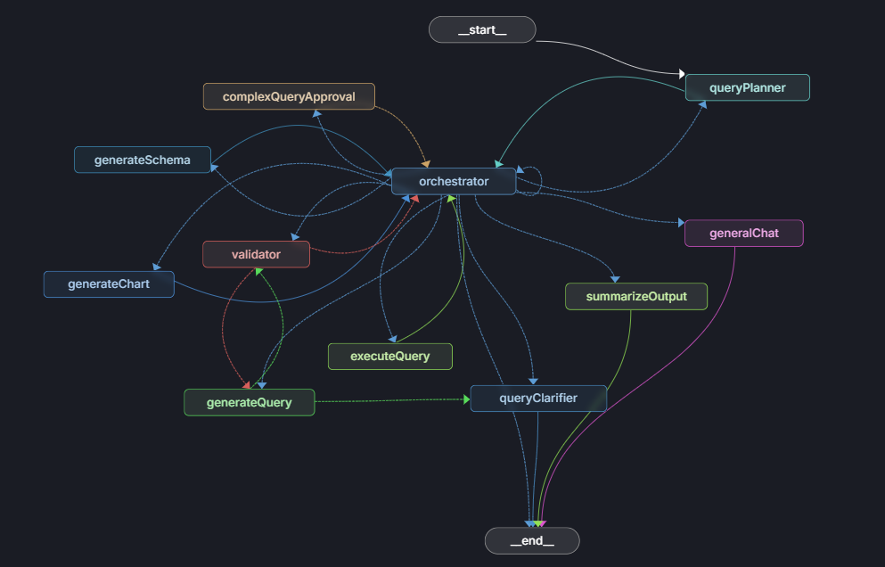

# 🧠 Query.fit  
### AI-Native Database Assistant

 
Query.fit is an **AI-powered database assistant** that allows users to query structured databases using **natural language**.

It converts user intent into **safe SQL queries**, executes them, and optionally visualizes results using charts — with **Human-in-the-Loop (HITL)** safeguards for sensitive operations.

> Built to explore real-world challenges in AI agents, database safety, and LLM orchestration.

---

## 🚨 Problem Statement

Querying databases requires:
- SQL knowledge  
- Awareness of schema  
- Caution around destructive queries  

Most existing AI tools:
- Execute unsafe queries  
- Store user data irresponsibly  
- Lack proper guardrails  

**Query.fit prioritizes correctness, safety, and explainability over blind automation.**

---

## 🏗️ Architecture Overview

### High-Level Flow

1. User asks a question in natural language  
2. LangGraph-based agent analyzes intent  
3. SQL query is generated and validated  
4. Risky queries require **Human-in-the-Loop approval**  
5. Results are returned as:
   - Table output  
   - Optional chart (bar / line / pie)

> Persistent memory is intentionally avoided to protect sensitive database information.

### Architecture Diagram

---

## 🤖 Why LangGraph?

LangGraph is used to:
- Model agent workflows as a **directed graph**
- Route decisions between:
  - Query generation  
  - Validation  
  - HITL approval  
  - Visualization  
- Prevent uncontrolled LLM execution  

This enables **deterministic control over non-deterministic models**.

---

## 🔐 Security & Safety Decisions

### ❌ No Persistent Chat Memory
- Database conversations may contain sensitive data  
- Storing history increases risk  
- Session-based, ephemeral memory is used instead  

### 🛑 Guardrails
- Destructive queries (`DELETE`, `DROP`, `UPDATE`) are blocked  
- HITL approval is required for risky operations  

---

## 📊 Chart Generation

Query.fit can automatically generate:
- Bar charts  
- Line charts  
- Pie charts  

Charts are generated **only when the query result is suitable**, preventing misleading visualizations.

---

## 🧠 Key Learnings

- AI agents need **constraints**, not autonomy  
- HITL is essential for database-related AI systems  
- Not all problems benefit from persistent memory  
- System design matters more than model choice  

---

## 🛠️ Tech Stack

- TypeScript  
- LangGraph  
- LangChain  
- Supabase  
- SQL (multi-database support)  
- Charting (bar / line / pie)

---

## 🎯 Who Is This For?

- Recruiters evaluating **AI / LLM engineers**  
- Engineers interested in **safe AI agents**  
- Developers exploring **database + LLM integrations**

---

> **Done > Perfect**  
> This project focuses on engineering tradeoffs, not feature bloat.
